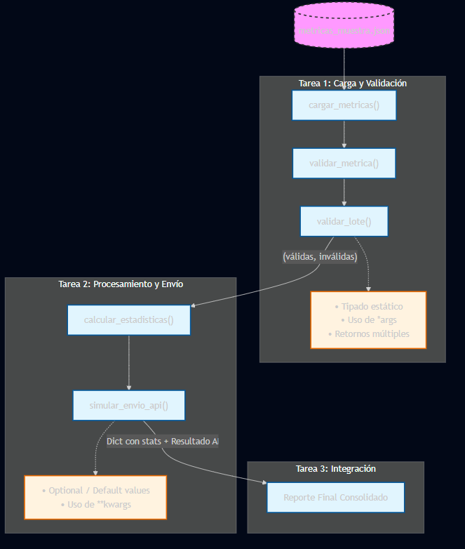
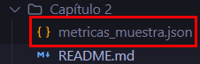
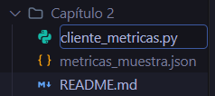
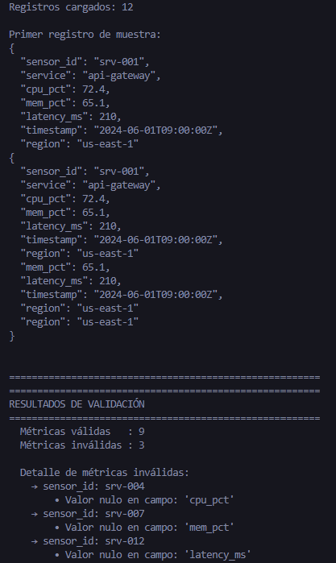
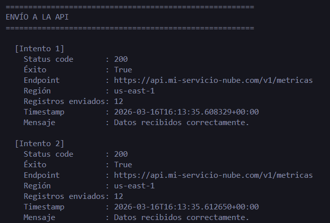

# Cliente de Métricas de Nube con Validación

## Objetivo de la práctica:

Al finalizar la práctica, serás capaz de:

* Diseñar un conjunto de funciones en Python organizadas como un “mini-SDK” para estructurar procesos de datos.
* Utilizar parámetros flexibles (`*args`, `**kwargs`), tipado estático (`Optional`, `List`, `Dict`) y retornos múltiples para construir funciones con contratos claros de entrada y salida.
* Implementar un flujo completo que cargue métricas desde un archivo JSON, las valide, las procese estadísticamente y simule su envío a un endpoint REST.

## Objetivo Visual



## Duración aproximada:
- 25–30 minutos.

## Dinámica del laboratorio

En cada tarea se presentan **tres fragmentos de código** para una función clave. Los tres fragmentos **funcionan correctamente** (no hay errores de sintaxis ni lógicos). Tu trabajo es **analizar, comparar y elegir el más adecuado** según:

| Criterio       | ¿Qué evaluar?                                                        |
|----------------|-----------------------------------------------------------------------|
| **Lógica**     | ¿Se aplica el concepto correcto para el problema?                     |
| **Eficiencia** | ¿Se evitan pasos innecesarios o redundancias?                         |
| **Legibilidad**| ¿Es fácil de leer, mantener y entender por otro desarrollador?        |
| **Buenas prácticas** | ¿Usa tipado estático, contratos claros y patrones profesionales? |


---

## Instrucciones

### **CONFIGURACIÓN DEL ENTORNO DE TRABAJO**

Paso 1. Abrir **Visual Studio Code**.

Paso 2. En el menú superior, seleccionar `Archivo` → `Abrir carpeta` y navegar hasta la carpeta del laboratorio `Capítulo 2`.


Paso 3. Verificar que el archivo `metricas_muestra.json` esté presente en la carpeta. Este archivo contiene 12 registros de métricas simuladas de distintos servicios en la nube, incluyendo intencionalmente algunos valores nulos (`null`) para practicar la validación.



Paso 4. Crear un nuevo archivo Python llamado `cliente_metricas.py`
. En el explorador de archivos de VS Code, hacer clic derecho dentro de la carpeta `Capítulo 2` y seleccionar `Nuevo archivo`. 



Paso 5. Verificar que Python esté instalado. Abrir la terminal integrada de VS Code y ejecutar el siguiente comando:

```shell
python --version
```

Paso 6. Verificar que se muestre una versión de ***Python 3.10 o superior***. Si no está instalado, descargarlo desde [https://www.python.org/downloads/](https://www.python.org/downloads/) o solicitar ayuda a su instructor.


---

### Tarea 1. **Carga de datos y validación de entrada**

Paso 7. Abrir `cliente_metricas.py` en VS Code e importar todos los módulos necesarios para el laboratorio:

```python
import json
import math
import random
from datetime import datetime, timezone
from typing import Optional, List, Dict, Any, Tuple
```

Paso 8. Definir la función `cargar_metricas()`. Esta función abre el archivo JSON y convierte su contenido en estructuras que Python pueda manipular. Para ello se utiliza el módulo `json`, que permite transformar los registros del archivo en una lista de diccionarios, facilitando su validación y procesamiento posterior:

```python
def cargar_metricas(ruta_archivo: str) -> List[Dict[str, Any]]:
    """
    Carga registros de métricas desde un archivo JSON.
    
    Args:
        ruta_archivo (str): Ruta del archivo JSON con las métricas.

    Returns:
        List[Dict[str, Any]]: Lista de diccionarios con las métricas.
    """
    with open(ruta_archivo, "r", encoding="utf-8") as f:
        datos = json.load(f)  # Convierte JSON en lista de diccionarios de Python
    return datos
```

---

####  Análisis de código — `validar_metrica()`

Se necesita una función que reciba un diccionario de métrica y valide que todos los campos obligatorios existan y que sus valores **no** sean **`None`**. Debe retornar si la métrica es válida y la lista de errores encontrados. Los campos requeridos son: `sensor_id`, `service`, `cpu_pct`, `mem_pct`, `latency_ms` y `timestamp`.

Analizar los tres fragmentos y elegir el **más adecuado**. Copiar el fragmento elegido en `cliente_metricas.py`.

**Fragmento A:**
```python
CAMPOS_REQUERIDOS = ["sensor_id", "service", "cpu_pct", "mem_pct", "latency_ms", "timestamp"]

def validar_metrica(metrica: Dict[str, Any]) -> Tuple[bool, List[str]]:
    """Valida campos requeridos y valores no nulos."""
    errores = []
    for campo in CAMPOS_REQUERIDOS:
        if campo not in metrica:
            errores.append(f"Campo faltante: '{campo}'")
        elif metrica[campo] is None:
            errores.append(f"Valor nulo en campo: '{campo}'")
    es_valida = len(errores) == 0
    return es_valida, errores
```

**Fragmento B:**
```python
def validar_metrica(metrica: Dict[str, Any]) -> Tuple[bool, List[str]]:
    """Valida campos requeridos y valores no nulos."""
    campos = ["sensor_id", "service", "cpu_pct", "mem_pct", "latency_ms", "timestamp"]
    errores = []
    for campo in campos:
        if campo not in metrica:
            errores.append(f"Campo faltante: '{campo}'")
        elif metrica[campo] is None:
            errores.append(f"Valor nulo en campo: '{campo}'")
    if len(errores) > 0:
        return False, errores
    else:
        return True, errores
```

**Fragmento C:**
```python
def validar_metrica(metrica, campos_requeridos):
    """Valida campos requeridos y valores no nulos."""
    errores = []
    for campo in campos_requeridos:
        if campo not in metrica:
            errores.append(f"Campo faltante: '{campo}'")
        elif metrica[campo] is None:
            errores.append(f"Valor nulo en campo: '{campo}'")
    es_valida = len(errores) == 0
    return es_valida, errores
```

<details>
<summary><strong> Ver respuesta recomendada</strong></summary>
<br>

**El Fragmento A es el más adecuado.**

| Criterio | A | B | C |
|---|---|---|---|
| **Legibilidad** |  Clara, concisa y con retorno directo (`len(errores) == 0`) | Funcional pero con `if/else` innecesario en el `return` | Aceptable, pero la lista se pasa como parámetro |
| **Tipado estático** |  Tipos completos en firma y retorno |  Tipos completos en firma y retorno |  Sin anotaciones de tipos en los parámetros |
| **Diseño** |  `CAMPOS_REQUERIDOS` como constante de módulo: reutilizable y fácil de mantener | Campos definidos como variable local dentro de la función | Campos como parámetro: obliga al llamador a conocer los campos |
| **Buenas prácticas** |  Patrón profesional de validación con constante y retorno limpio | Patrón correcto pero `if/else` al final es verbose | Diseño frágil: el contrato de validación depende del llamador |


</details>

---

#### Análisis de código — `validar_lote()`

Se necesita una función que reciba **cualquier cantidad de métricas** de forma flexible (sin obligar a pasarlas como lista), las valide ***una por una*** usando `validar_metrica()`, y retorne dos listas: las válidas y las inválidas (con detalle de errores).

Analizar los tres fragmentos y elegir el **más adecuado**. Copiar el fragmento elegido en `cliente_metricas.py`.

**Fragmento A:**
```python
def validar_lote(metricas_lista: List[Dict[str, Any]]) -> Tuple[List[Dict], List[Dict]]:
    """Valida un lote de métricas recibidas como lista."""
    validas = []
    invalidas = []
    for metrica in metricas_lista:
        es_valida, errores = validar_metrica(metrica)
        if es_valida:
            validas.append(metrica)
        else:
            invalidas.append({
                "sensor_id": metrica.get("sensor_id", "DESCONOCIDO"),
                "errores": errores
            })
    return validas, invalidas
```

**Fragmento B:**
```python
def validar_lote(*args: Dict[str, Any]) -> Tuple[List[Dict], List[Dict]]:
    """Valida un lote de métricas recibidas como argumentos posicionales (*args)."""
    validas = []
    invalidas = []
    for metrica in args:
        es_valida, errores = validar_metrica(metrica)
        if es_valida:
            validas.append(metrica)
        else:
            invalidas.append({
                "sensor_id": metrica.get("sensor_id", "DESCONOCIDO"),
                "errores": errores
            })
    return validas, invalidas
```

**Fragmento C:**
```python
def validar_lote(*args: Dict[str, Any]) -> Tuple[List[Dict], List[Dict]]:
    """Valida un lote de métricas recibidas como argumentos posicionales (*args)."""
    validas = []
    invalidas = []
    for i in range(len(args)):
        es_valida, errores = validar_metrica(args[i])
        if es_valida:
            validas.append(args[i])
        else:
            invalidas.append({
                "sensor_id": args[i].get("sensor_id", "DESCONOCIDO"),
                "errores": errores
            })
    return validas, invalidas
```

<details>
<summary><strong> Ver respuesta recomendada</strong></summary>

<br>

**El Fragmento B es el más adecuado.**

| Criterio | A | B | C |
|---|---|---|---|
| **Uso de `*args`** |  Recibe una lista explícita, no practica `*args` |  Usa `*args` correctamente para recibir métricas individuales |  Usa `*args` correctamente |
| **Iteración** |  Pythónica (`for metrica in lista`) |  Pythónica (`for metrica in args`) |  Por índice (`for i in range(len(args))`) — anti-patrón en Python |
| **Legibilidad** |  Clara y directa |  Clara y directa | Verbose y menos legible por el acceso con `args[i]` |
| **Tipado estático** |  Completo |  Completo |  Completo |


</details>

---

Paso 9. Después de elegir y copiar ambas funciones, llamar a la función de carga y validar el lote completo. Primero se cargan las métricas con `cargar_metricas()` para comprobar que los datos se leyeron correctamente. Luego se utiliza el operador `*` (unpacking) para desempaquetar la lista y pasar cada métrica como argumento individual a `validar_lote()`, ya que la función fue diseñada para recibir múltiples argumentos mediante `*args`:

```python
metricas = cargar_metricas("metricas_muestra.json")
print(f"Registros cargados: {len(metricas)}")
print(f"\nPrimer registro de muestra:")
print(json.dumps(metricas[0], indent=2))

validas, invalidas = validar_lote(*metricas)

print(f"\n{'='*55}")
print("RESULTADOS DE VALIDACIÓN")
print('='*55)
print(f"  Métricas válidas   : {len(validas)}")
print(f"  Métricas inválidas : {len(invalidas)}")

if invalidas:
    print(f"\n  Detalle de métricas inválidas:")
    for inv in invalidas:
        print(f"    → sensor_id: {inv['sensor_id']}")
        for err in inv['errores']:
            print(f"        • {err}")
```

Paso 10. Ejecutar el script para verificar la carga y validación. En la terminal de VS Code:

```shell
python cliente_metricas.py
```



---

### Tarea 2. **Procesamiento de métricas y simulación de envío**

#### Análisis de código — `calcular_estadisticas()`

Se necesita una función que reciba la lista de métricas válidas y el **nombre de una métrica numérica** (por ejemplo, `"cpu_pct"`). El nombre de la métrica es **opcional**: si no se proporciona, debe usar `"cpu_pct"` como valor por defecto.

Debe calcular promedio, máximo, mínimo y desviación estándar, y retornar un diccionario con los resultados.

Analizar los tres fragmentos y elegir el **más adecuado**. Copiar el fragmento elegido en `cliente_metricas.py`.

**Fragmento A:**
```python
def calcular_estadisticas(
    metricas: List[Dict[str, Any]],
    metrica_nombre: Optional[str] = None
) -> Dict[str, Any]:
    """Calcula estadísticas de una métrica numérica dentro del lote."""
    if metrica_nombre is None:
        metrica_nombre = "cpu_pct"

    valores = [
        reg[metrica_nombre]
        for reg in metricas
        if isinstance(reg.get(metrica_nombre), (int, float))
    ]

    if not valores:
        return {"error": f"No hay valores válidos para '{metrica_nombre}'"}

    promedio = sum(valores) / len(valores)
    varianza = sum((v - promedio) ** 2 for v in valores) / len(valores)

    return {
        "metrica"  : metrica_nombre,
        "muestras" : len(valores),
        "promedio" : round(promedio, 2),
        "maximo"   : max(valores),
        "minimo"   : min(valores),
        "desv_std" : round(math.sqrt(varianza), 2)
    }
```

**Fragmento B:**
```python
def calcular_estadisticas(
    metricas: List[Dict[str, Any]],
    metrica_nombre: str = "cpu_pct"
) -> Dict[str, Any]:
    """Calcula estadísticas de una métrica numérica dentro del lote."""
    valores = []
    for reg in metricas:
        val = reg.get(metrica_nombre)
        if isinstance(val, (int, float)):
            valores.append(val)

    if not valores:
        return {"error": f"No hay valores válidos para '{metrica_nombre}'"}

    promedio = sum(valores) / len(valores)
    varianza = sum((v - promedio) ** 2 for v in valores) / len(valores)

    return {
        "metrica"  : metrica_nombre,
        "muestras" : len(valores),
        "promedio" : round(promedio, 2),
        "maximo"   : max(valores),
        "minimo"   : min(valores),
        "desv_std" : round(math.sqrt(varianza), 2)
    }
```

**Fragmento C:**
```python
def calcular_estadisticas(
    metricas: List[Dict[str, Any]],
    metrica_nombre: Optional[str] = None
) -> Dict[str, Any]:
    """Calcula estadísticas de una métrica numérica dentro del lote."""
    if metrica_nombre is None:
        metrica_nombre = "cpu_pct"

    valores = [reg[metrica_nombre] for reg in metricas]

    if not valores:
        return {"error": f"No hay valores válidos para '{metrica_nombre}'"}

    promedio = sum(valores) / len(valores)
    varianza = sum((v - promedio) ** 2 for v in valores) / len(valores)

    return {
        "metrica"  : metrica_nombre,
        "muestras" : len(valores),
        "promedio" : round(promedio, 2),
        "maximo"   : max(valores),
        "minimo"   : min(valores),
        "desv_std" : round(math.sqrt(varianza), 2)
    }
```

<details>
<summary><strong> Ver respuesta recomendada</strong></summary>
<br>

**El Fragmento A es el más adecuado.**

| Criterio | A | B | C |
|---|---|---|---|
| **Uso de `Optional`** |  `Optional[str] = None` — comunica explícitamente que el parámetro puede omitirse |  `str = "cpu_pct"` — funciona pero no expresa que puede ser `None` |  Usa `Optional[str] = None` |
| **Filtrado de valores** |  Filtra con `isinstance(..., (int, float))` — robusto ante `None` o strings |  Filtra correctamente con `isinstance` |  No filtra: `reg[metrica_nombre]` incluye `None` y otros tipos, causando errores en cálculos |
| **Legibilidad** |  List comprehension clara y concisa | Aceptable, pero el bucle `for` + `append` es más verbose |  Conciso, pero peligroso por falta de filtrado |
| **Robustez** |  Maneja datos faltantes o inválidos sin errores |  Maneja datos correctamente |  Falla con `TypeError` si algún valor es `None` al calcular promedio o varianza |

</details>

---

#### Análisis de código — `simular_envio_api()`

Se necesita una función que reciba un diccionario `payload` con los datos a enviar, y **parámetros de configuración opcionales con nombre** (endpoint, token, región, timeout). El cliente no siempre conoce todos los parámetros de antemano, así que la función debe aceptar cualquier clave extra de forma flexible. 

Debe simular el envío y retornar un diccionario con un contrato fijo de campos.

Analizar los tres fragmentos y elegir el **más adecuado**. Copiar el fragmento elegido en `cliente_metricas.py`.

**Fragmento A:**
```python
def simular_envio_api(
    payload: Dict[str, Any],
    endpoint: str = "https://api.nube-ejemplo.com/v1/metricas",
    token: str = "tok-***simulado***",
    region: str = "us-east-1",
    timeout_s: int = 5
) -> Dict[str, Any]:
    """Simula el envío de un payload a un endpoint REST."""
    exito = random.random() > 0.2
    codigo_estado = 200 if exito else 503

    return {
        "status_code": codigo_estado,
        "exito": exito,
        "endpoint": endpoint,
        "region": region,
        "token_usado": token,
        "timeout_s": timeout_s,
        "registros_enviados": payload.get("total_registros", 0),
        "timestamp_envio": datetime.now(timezone.utc).isoformat(),
        "mensaje": "Datos recibidos correctamente." if exito
                   else "Error 503: Servicio temporalmente no disponible."
    }
```

**Fragmento B:**
```python
def simular_envio_api(
    payload: Dict[str, Any],
    **kwargs: Any
) -> Dict[str, Any]:
    """Simula el envío de un payload a un endpoint REST."""
    endpoint  = kwargs.get("endpoint",  "https://api.nube-ejemplo.com/v1/metricas")
    token     = kwargs.get("token",     "tok-***simulado***")
    region    = kwargs.get("region",    "us-east-1")
    timeout_s = kwargs.get("timeout_s", 5)

    exito = random.random() > 0.2
    codigo_estado = 200 if exito else 503

    return {
        "status_code": codigo_estado,
        "exito": exito,
        "endpoint": endpoint,
        "region": region,
        "token_usado": token,
        "timeout_s": timeout_s,
        "registros_enviados": payload.get("total_registros", 0),
        "timestamp_envio": datetime.now(timezone.utc).isoformat(),
        "mensaje": "Datos recibidos correctamente." if exito
                   else "Error 503: Servicio temporalmente no disponible."
    }
```

**Fragmento C:**
```python
def simular_envio_api(payload, config):
    """Simula el envío de un payload a un endpoint REST."""
    endpoint  = config["endpoint"]
    token     = config["token"]
    region    = config["region"]
    timeout_s = config["timeout_s"]

    exito = random.random() > 0.2
    codigo_estado = 200 if exito else 503

    return {
        "status_code": codigo_estado,
        "exito": exito,
        "endpoint": endpoint,
        "region": region,
        "token_usado": token,
        "timeout_s": timeout_s,
        "registros_enviados": payload.get("total_registros", 0),
        "timestamp_envio": datetime.now(timezone.utc).isoformat(),
        "mensaje": "Datos recibidos correctamente." if exito
                   else "Error 503: Servicio temporalmente no disponible."
    }
```

<details>
<summary><strong> Ver respuesta recomendada</strong></summary>
<br>

**El Fragmento B es el más adecuado.**

| Criterio | A | B | C |
|---|---|---|---|
| **Uso de `**kwargs`** |  Parámetros explícitos con valores por defecto, no practica `**kwargs` |  Usa `**kwargs` correctamente con `.get()` y valores por defecto |  Recibe un diccionario `config`, no usa `**kwargs` |
| **Flexibilidad** | Limitada: solo acepta los parámetros definidos en la firma |  Acepta cualquier clave adicional sin modificar la firma |  Requiere que el diccionario tenga todas las claves, sin valores por defecto |
| **Tipado estático** |  Tipos en `payload` y retorno |  Tipos en `payload`, `**kwargs` y retorno |  Sin anotaciones de tipos |
| **Robustez** |  Siempre funciona gracias a valores por defecto |  Siempre funciona gracias a `.get()` con fallbacks |  Lanza `KeyError` si falta alguna clave en `config` |

</details>

---

Paso 11. Después de elegir y copiar ambas funciones, agregar el código para calcular estadísticas y enviar el payload a una API. Se deben procesar las métricas válidas para calcular indicadores como promedio, máximo, mínimo y desviación estándar, yconstruir un `payload` con los resultados para aprener como seria su envío a una API:

```python
# ── Estadísticas ──
metricas_a_analizar = ["cpu_pct", "mem_pct", "latency_ms"]

print(f"\n{'='*55}")
print("ESTADÍSTICAS POR MÉTRICA")
print('='*55)

resultados_stats = {}
for nombre in metricas_a_analizar:
    stats = calcular_estadisticas(validas, metrica_nombre=nombre)
    resultados_stats[nombre] = stats
    print(f"\n  [{stats['metrica'].upper()}]")
    print(f"    Muestras válidas : {stats['muestras']}")
    print(f"    Promedio         : {stats['promedio']}")
    print(f"    Máximo           : {stats['maximo']}")
    print(f"    Mínimo           : {stats['minimo']}")
    print(f"    Desv. estándar   : {stats['desv_std']}")

# ── Envío ──
payload_final = {
    "total_registros"    : len(metricas),
    "registros_validos"  : len(validas),
    "registros_invalidos": len(invalidas),
    "estadisticas"       : resultados_stats
}

print(f"\n{'='*55}")
print("ENVÍO A LA API")
print('='*55)

for intento in range(1, 3):
    resultado = simular_envio_api(
        payload_final,
        endpoint  = "https://api.mi-servicio-nube.com/v1/metricas",
        token     = "Bearer eyJhbGci...simulado",
        region    = "us-east-1",
        timeout_s = 10
    )
    print(f"\n  [Intento {intento}]")
    print(f"    Status code       : {resultado['status_code']}")
    print(f"    Éxito             : {resultado['exito']}")
    print(f"    Endpoint          : {resultado['endpoint']}")
    print(f"    Región            : {resultado['region']}")
    print(f"    Registros enviados: {resultado['registros_enviados']}")
    print(f"    Timestamp         : {resultado['timestamp_envio']}")
    print(f"    Mensaje           : {resultado['mensaje']}")
```



---

### Tarea 3. **Reporte final consolidado**

Paso 12. Imprimir un reporte consolidado que muestre el flujo completo del mini-SDK en pantalla. Agregar el siguiente bloque al final del archivo y ejecutar el script completo:

```python
print(f"\n{'='*55}")
print("REPORTE FINAL CONSOLIDADO DEL MINI-SDK")
print('='*55)
print(json.dumps(payload_final, indent=2, ensure_ascii=False))
```

```shell
python cliente_metricas.py
```

---

### Resultado esperado

Al ejecutar el script completo, la terminal deberá mostrar una salida similar a la siguiente:

```
Registros cargados: 12

Primer registro de muestra:
{
  "sensor_id": "srv-001",
  "service": "api-gateway",
  "cpu_pct": 72.4,
  ...
}

=======================================================
RESULTADOS DE VALIDACIÓN
=======================================================
  Métricas válidas   : 9
  Métricas inválidas : 3

  Detalle de métricas inválidas:
    → sensor_id: srv-004
        • Valor nulo en campo: 'cpu_pct'
    → sensor_id: srv-007
        • Valor nulo en campo: 'mem_pct'
    → sensor_id: srv-012
        • Valor nulo en campo: 'latency_ms'

=======================================================
ESTADÍSTICAS POR MÉTRICA
=======================================================

  [CPU_PCT]
    Muestras válidas : 9
    Promedio         : 56.53
    Máximo           : 95.1
    Mínimo           : 18.0
    Desv. estándar   : 24.87

  [MEM_PCT]
    Muestras válidas : 9
    ...

  [LATENCY_MS]
    Muestras válidas : 9
    ...

=======================================================
ENVÍO A LA API
=======================================================

  [Intento 1]
    Status code       : 200
    Éxito             : True
    Endpoint          : https://api.mi-servicio-nube.com/v1/metricas
    Región            : us-east-1
    Registros enviados: 12
    Timestamp         : 2024-06-01T14:32:10.123456+00:00
    Mensaje           : Datos recibidos correctamente.

  [Intento 2]
    Status code       : 503
    Éxito             : False
    ...
    Mensaje           : Error 503: Servicio temporalmente no disponible.
```
