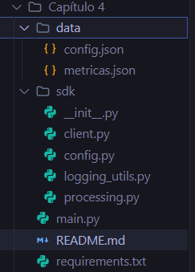
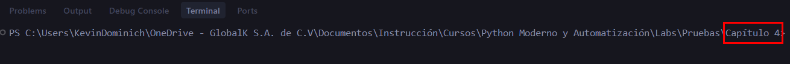
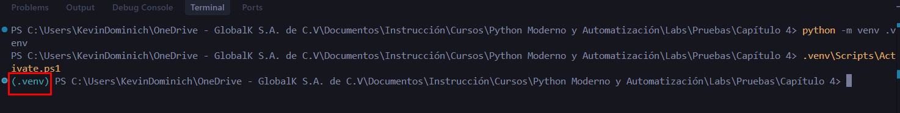
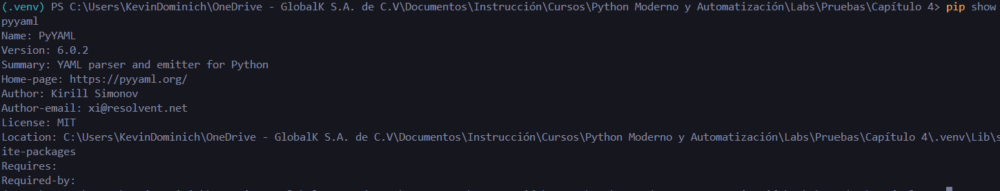
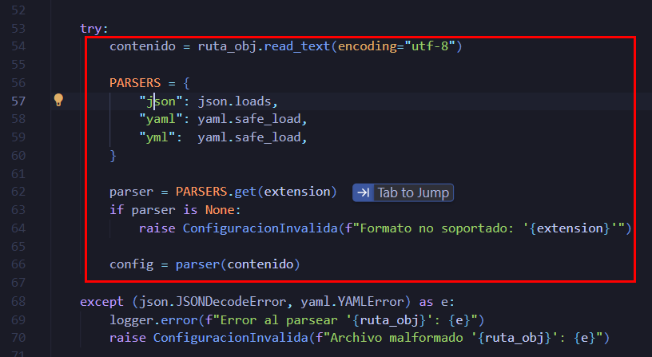
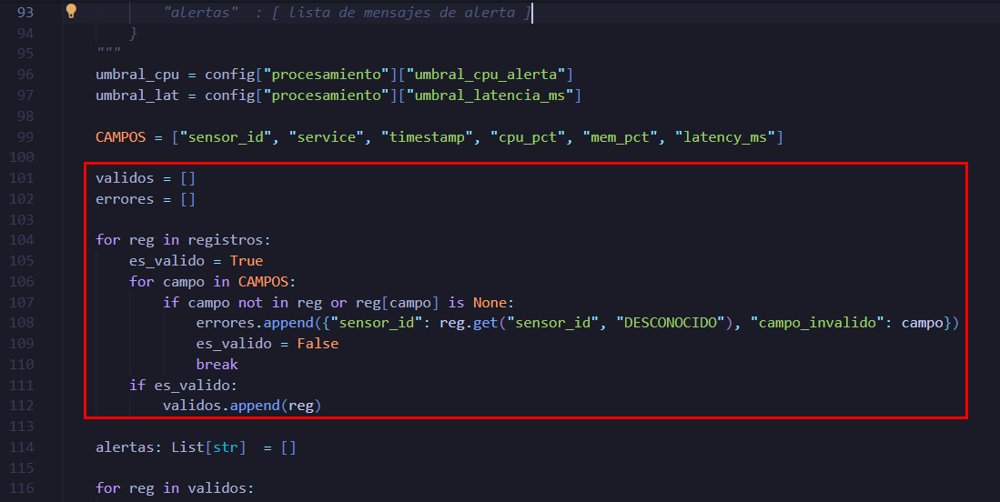
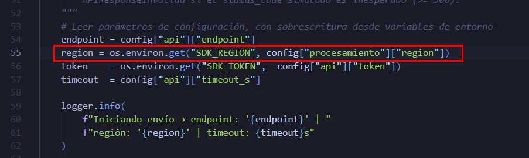
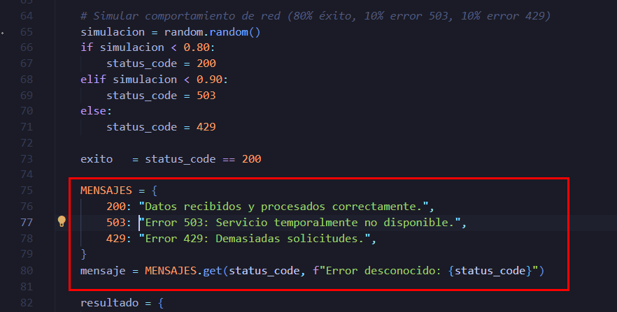

# Mini-SDK Modular con Entorno Reproducible

## Objetivo de la práctica:

Al finalizar la práctica, serás capaz de:

* Estructurar un proyecto Python profesional en módulos con responsabilidades separadas.
* Gestionar dependencias mediante un entorno virtual (`venv`) y un archivo `requirements.txt`.
* Utilizar las librerías `pathlib`, `os` y `sys` para desarrollar código portable y construir un mini-SDK funcional con flujo de configuración, procesamiento y envío a una API REST.

## Objetivo Visual

```
Capítulo 4/
├── sdk/                         ← Paquete Python (módulos del SDK)
│   ├── __init__.py              │
│   ├── logging_utils.py  ───── Logger centralizado
│   ├── config.py         ───── Carga JSON/YAML con pathlib
│   ├── processing.py     ───── Estadísticas + alertas
│   └── client.py         ───── Cliente REST
│
├── data/                        ← Archivos de datos
│   ├── config.json       ───── Configuración del SDK
│   └── metricas.json     ───── Dataset de sensores
│
├── main.py               ───── Script principal (orquesta todo)
├── requirements.txt      ───── Dependencias reproducibles
└── sdk_eventos.log       ───── Generado al ejecutar main.py
```

## Duración aproximada:
- 25–30 minutos.

## Instrucciones

### **CONFIGURACIÓN DEL ENTORNO DE TRABAJO**

Paso 1. Abrir **Visual Studio Code**.

Paso 2. En el menú superior, seleccionar `Archivo` → `Abrir carpeta` y navegar hasta la carpeta del laboratorio `Capítulo 4`.


> Es importante abrir **la carpeta raíz** `Capítulo 4/` y no una subcarpeta, ya que `main.py` necesita encontrar los módulos de `sdk/` y los archivos de `data/`.

Paso 3. Verificar que la estructura de archivos sea la correcta. En el explorador de VS Code (panel izquierdo) debe verse la carpeta `sdk/` con sus 5 archivos (incluido `__init__.py`), la carpeta `data/` con `config.json` y `metricas.json`, los archivos `main.py` y `requirements.txt` en la raíz.



Paso 4. Abrir la terminal integrada de VS Code y verificar que el directorio de trabajo sea `Capítulo 4/` (debe aparecer en el prompt de la terminal).



---

### Tarea 1. **Crear y activar el entorno virtual**

Paso 5. Crear el entorno virtual dentro de la carpeta del proyecto:

```shell
python -m venv .venv
```

Paso 6. Activar el entorno virtual:

```shell
.venv\Scripts\Activate.ps1
```

> Después de ejecutar este comando, el prompt debe mostrar `(.venv)` al inicio de la línea, confirmando que el entorno virtual está activo.



---

### Tarea 2. **Instalar dependencias desde `requirements.txt`**

Paso 7. Con el entorno virtual activado, instalar las dependencias. Este archivo centraliza la lista de librerías necesarias para el proyecto y sus versiones exactas, lo que permite recrear el mismo entorno de ejecución en diferentes máquinas.:

```shell
pip install -r requirements.txt
```

Paso 8. Verificar que `pyyaml` quedó instalado dentro del entorno virtual:

```shell
pip show pyyaml
```



---

### Tarea 3. **Análisis de código — Elige la mejor opción**

**Los tres fragmentos presentados en cada grupo son funcionales** (ninguno da error), pero difieren en legibilidad, eficiencia o adherencia a buenas prácticas de Python moderno. 

**Analiza, compara y elige cuál es el más adecuado** para cada situación.


---

#### 3.1 Cargar un archivo de configuración según su extensión

El módulo `sdk/config.py` necesita cargar la configuración desde un archivo que puede ser `.json` o `.yaml`. 

Dado el archivo `sdk/config.py`, desde la línea 54, completa la implementación seleccionando la opción que **sea la más adecuada para un SDK profesional**. Considera:
- ¿Cuál gestiona correctamente el cierre del archivo?
- ¿Cuál usa `pathlib` para portabilidad entre sistemas operativos?
- ¿Cuál es más fácil de extender si se necesita soportar un formato nuevo (por ejemplo `.toml`)?

**Fragmento A:**
```python
        with ruta_obj.open("r", encoding="utf-8") as f:
            if extension == ".json":
                config = json.load(f)
            elif extension in (".yaml", ".yml"):
                config = yaml.safe_load(f)
            else:
                raise ConfiguracionInvalida(
                    f"Formato no soportado: '{extension}'. Use .json o .yaml"
                )
```

**Fragmento B:**
```python
        texto = open(ruta_obj, "r").read()

        if extension == ".json":
            config = json.loads(texto)
        elif extension == ".yaml" or extension == ".yml":
            config = yaml.safe_load(texto)
        else:
            raise ConfiguracionInvalida("Formato no soportado")
```

**Fragmento C:**
```python
        contenido = ruta_obj.read_text(encoding="utf-8")
        
        PARSERS = {
            ".json": json.loads,
            ".yaml": yaml.safe_load,
            ".yml":  yaml.safe_load,
        }
        
        parser = PARSERS.get(extension)
        if parser is None:
            raise ConfiguracionInvalida(f"Formato no soportado: '{extension}'")
            
        config = parser(contenido)
```


<details>
<summary><strong> Ver respuesta recomendada</strong></summary>

<br>

**El Fragmento C es el más adecuado.**

| Criterio | A | B | C |
|---|---|---|---|
| **Gestión de archivos** |  Usa `with` |  No cierra el archivo |  Usa `.read_text()` que lo maneja internamente |
| **Portabilidad (`pathlib`)**| Usa `Path` |  Usa `open()` con string |  Usa `Path` |
| **Extensibilidad** |  Usa `if/elif` |  Usa `if/elif` |  Usa un diccionario (Dispatch table) fácil de extender |



</details>

---

#### 3.2 Validar registros y filtrar datos inválidos

El módulo `sdk/processing.py` necesita separar registros válidos de inválidos, verificando que todos los campos obligatorios existan y no sean `None`.

Dado el archivo `sdk/processing.py`, desde la línea 99, completa la implementación seleccionando la opción que **sea la más adecuada para este SDK**.

**Fragmento A:**
```python
    validos = []
    errores = []

    for reg in registros:
        es_valido = True
        for campo in CAMPOS:
            if campo not in reg or reg[campo] is None:
                errores.append({"sensor_id": reg.get("sensor_id", "DESCONOCIDO"), "campo_invalido": campo})
                es_valido = False
                break
        if es_valido:
            validos.append(reg)
```

**Fragmento B:**
```python
    validos = [r for r in registros
               if all(c in r and r[c] is not None for c in CAMPOS)]

    errores = [{"sensor_id": r.get("sensor_id", "DESCONOCIDO"), "campo_invalido": "X"} for r in registros if r not in validos]
```

**Fragmento C:**
```python
    validos = []
    errores = []

    for i in range(len(registros)):
        ok = True
        for j in range(len(CAMPOS)):
            if CAMPOS[j] not in registros[i]:
                ok = False
            elif registros[i][CAMPOS[j]] is None:
                ok = False
        if ok:
            validos.append(registros[i])
        else:
            errores.append({"sensor_id": registros[i].get("sensor_id", "DESCONOCIDO"), "campo_invalido": "X"})
```


<details>
<summary><strong> Ver respuesta recomendada</strong></summary>

<br>

**El Fragmento A es el más adecuado.**

| Criterio | A | B | C |
|---|---|---|---|
| **Claridad del error** |  Captura el campo exacto que falló |  Sólo guarda el registro inválido |  Sólo guarda el registro inválido |
| **Legibilidad** |  Estructurado y claro |  Usa comprensiones anidadas y complejas |  Usa iteración por índices anti-idiomática (`range(len())`) |
| **Eficiencia** |  Una sola pasada |  Itera la lista completa dos veces |  Una sola pasada |



</details>

---

#### 3.3 Leer una variable de entorno con valor por defecto

El módulo `sdk/client.py` necesita leer la región desde una variable de entorno `SDK_REGION`. Si no existe, debe usar el valor del archivo de configuración. 

Dado el archivo `sdk/client.py`, desde la línea 55, completa la implementación seleccionando la opción que **sea la más adecuada para un caso donde la ausencia de la variable es normal (no es un error)**.

**Fragmento A:**
```python
    region = os.environ.get("SDK_REGION", config["procesamiento"]["region"])
```

**Fragmento B:**
```python
    if "SDK_REGION" in os.environ:
        region = os.environ["SDK_REGION"]
    else:
        region = config["procesamiento"]["region"]
```

**Fragmento C:**
```python
    try:
        region = os.environ["SDK_REGION"]
    except KeyError:
        region = config["procesamiento"]["region"]
```


<details>
<summary><strong> Ver respuesta recomendada</strong></summary>

<br>

**El Fragmento A es el más adecuado.**

| Criterio | A | B | C |
|---|---|---|---|
| **Concisión** |  Una sola línea clara |  Verboso (4 líneas) |  Verboso (4 líneas) |
| **Manejo de flujo** |  Usa `.get()` diseñado para esto |  Usa condicional manual |  Abusa de excepciones para flujo normal |
| **Uso del estándar** |  Aprovecha `os.environ.get()` |  No aprovecha herramientas del entorno |  Válido si fallar fuera excepcional |



</details>

---

#### 3.4 Mapear códigos HTTP a mensajes descriptivos

El módulo `sdk/client.py` necesita asignar un mensaje de texto según el código de respuesta HTTP (`200`, `503`, `429`). 

Dado el archivo `sdk/client.py`, desde la línea 74, completa la implementación de cómo asignar el mensaje de texto. 

Se debe considerar:

- Aquel que evita la redundancia y es más fácil de mantener si se agregan nuevos códigos.
- Aquel que usa una estructura de datos en lugar de lógica repetitiva.
- Aquel que no tiene código innecesario que no aporta valor.

**Fragmento A:**
```python
    if status_code == 200:
        mensaje = "Datos recibidos y procesados correctamente."
    elif status_code == 503:
        mensaje = "Error 503: Servicio temporalmente no disponible."
    elif status_code == 429:
        mensaje = "Error 429: Demasiadas solicitudes."
    else:
        mensaje = f"Error desconocido: {status_code}"
```

**Fragmento B:**
```python
    MENSAJES = {
        200: "Datos recibidos y procesados correctamente.",
        503: "Error 503: Servicio temporalmente no disponible.",
        429: "Error 429: Demasiadas solicitudes.",
    }
    mensaje = MENSAJES.get(status_code, f"Error desconocido: {status_code}")
```

**Fragmento C:**
```python
    mensajes = {200: "OK", 503: "503", 429: "429"}

    if status_code in mensajes:
        if status_code == 200:
            mensaje = "Datos recibidos y procesados correctamente."
        elif status_code == 503:
            mensaje = "Error 503: Servicio temporalmente no disponible."
        elif status_code == 429:
            mensaje = "Error 429: Demasiadas solicitudes."
    else:
        mensaje = f"Error desconocido: {status_code}"
```


<details>
<summary><strong> Ver respuesta recomendada</strong></summary>

<br>

**El Fragmento B es el más adecuado.**

| Criterio | A | B | C |
|---|---|---|---|
| **Mantenibilidad** |  Condicionales anidados (difícil de escalar) |  Diccionario fácil de actualizar |  Condicionales redundantes |
| **Estructura** |  Lógica repetitiva `elif` |  Mapeos directos con diccionarios |  Doble comprobación y redundancia |
| **Legibilidad** |  Verboso |  Elegante y declarativo |  Complejo y repetitivo |



</details>

---

### Tarea 4. **Ejecutar el mini-SDK**

Paso 9. Abrir el archivo main.py y observar cómo se construye la ruta raíz del proyecto utilizando `Path(__file__).resolve().parent`. Este enfoque permite determinar la ubicación del script de forma dinámica, independientemente del directorio desde el cual se ejecute el programa:

```python
ROOT = Path(__file__).resolve().parent
if str(ROOT) not in sys.path:
    sys.path.insert(0, str(ROOT))
```

Paso 10. Con el entorno virtual activo (`(.venv)` en el prompt), ejecutar el script principal:

```shell
python main.py
```

Paso 11. Verificar que el archivo `sdk_eventos.log` fue generado en la raíz del proyecto. Abrirlo para ver el registro de eventos:

```shell
type sdk_eventos.log
```

---

### Resultado esperado

Al ejecutar `python main.py` con el entorno virtual activo, la terminal mostrará una salida similar a:

```
2024-06-01 09:00:00 | INFO     | sdk_nube | Log también guardado en: 'sdk_eventos.log'
2024-06-01 09:00:00 | INFO     | sdk_nube | ═══════════════════════════════════════
2024-06-01 09:00:00 | INFO     | sdk_nube | Iniciando mini-SDK modular de métricas

=======================================================
PASO 1 — CARGA DE CONFIGURACIÓN
=======================================================
  Endpoint   : https://api.mi-nube.com/v2/metricas
  Región     : us-east-1
  Umbral CPU : 85.0%
  Umbral lat.: 500 ms

=======================================================
PASO 2 — CARGA Y PROCESAMIENTO DE MÉTRICAS
=======================================================
  Status          : parcial
  Total registros : 12
  Válidos         : 9
  Inválidos       : 3
  Alertas         : 4

  Estadísticas por campo:
    [CPU_PCT]
      Promedio   : 60.19
      Máximo     : 95.1
      Mínimo     : 18.0
      Desv. std  : 27.83
      Muestras   : 9
    ...

=======================================================
PASO 3 — ENVÍO A LA API
=======================================================

  [Intento 1/3]
    Status code       : 200
    Éxito             : True
    Endpoint          : https://api.mi-nube.com/v2/metricas
    Región            : us-east-1
    Registros enviados: 12
    Timestamp         : 2024-06-01T14:00:00.123456+00:00
    Mensaje           : Datos recibidos y procesados correctamente.

=======================================================
REPORTE FINAL CONSOLIDADO
=======================================================
{
  "total_procesados": 12,
  "registros_validos": 9,
  "estadisticas": { ... },
  "alertas_generadas": 4
}
```
