# Análisis de Logs JSON de un Servicio en la Nube

## Objetivo de la práctica:

Al finalizar la práctica, serás capaz de:

* Manejar estructuras de datos avanzadas en Python, como listas, diccionarios y sets, para procesar registros en formato JSON.
* Aplicar técnicas de filtrado, transformación y agregación de datos para extraer información relevante.
* Seleccionar la estructura de datos más adecuada según la tarea y preparar la manipulación de datos para su uso en APIs REST en prácticas futuras.

## Objetivo Visual

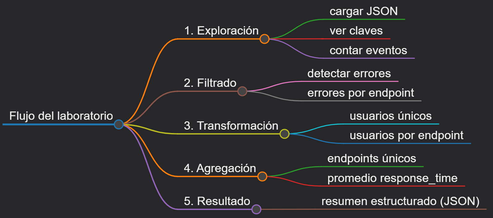

## Duración aproximada:

* 20 minutos.

## Instrucciones

### **CONFIGURACIÓN DEL ENTORNO DE TRABAJO**

Paso 1. Abrir **Visual Studio Code**.

Paso 2. En el menú superior, seleccionar `Archivo` → `Abrir carpeta` y navegar hasta la carpeta del laboratorio `Capítulo 1`.

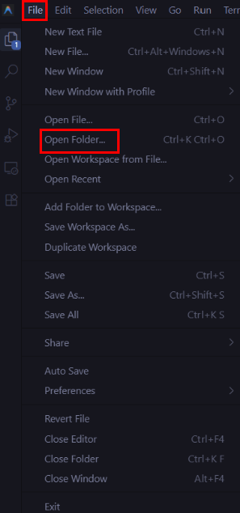

Paso 3. Dentro de la carpeta del laboratorio, verificar que el archivo `cloud_logs.json` esté presente, ya que contiene 30 registros de logs de un servicio en la nube.

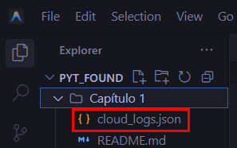

Paso 4. Crear un nuevo archivo Python llamado `analisis_logs.py`. Para ello, en el explorador de archivos de VS Code, hacer clic derecho dentro de la carpeta `Capítulo 1` y seleccionar `Nuevo archivo`.

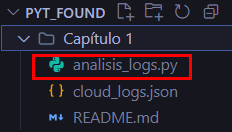

Paso 5. Verificar que Python esté instalado. Abrir la terminal integrada de VS Code y ejecutar el siguiente comando:

```shell
python --version
```

Paso 6. Verificar que se muestre una versión de ***Python 3.10 o superior***. Si no está instalado, descargarlo desde [https://www.python.org/downloads/](https://www.python.org/downloads/) o solicitar ayuda a su instructor.

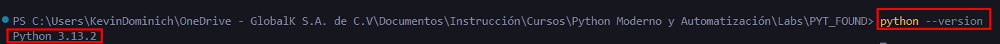

---

### Tarea 1. **Cargar y explorar el dataset**

Paso 7. Como se revisó en el archivo `cloud_logs.json`, este contiene información en formato JSON que Python debe interpretar como objetos. Para ello, se debe abrir el archivo `analisis_logs.py` previamente creado e importar el módulo *json*. Además, se necesitarán clases que faciliten el monitoreo y manejo de los elementos, por lo que se importarán *defaultdict* y *Counter*, que provienen del módulo *collections*, especializado en estructuras de datos avanzadas. Con ello, ya es posible abrir el archivo mencionado.

```python
import json
from collections import defaultdict, Counter  # Estructuras especializadas para conteo y agrupación

# Abrir el archivo JSON en modo lectura ('r') y cargar su contenido en memoria
with open("cloud_logs.json", "r", encoding="utf-8") as f:
    logs = json.load(f)  # Convertir el JSON en estructuras de Python (lista de diccionarios)
```

> El archivo `cloud_logs.json` debe estar en la misma carpeta que `analisis_logs.py`.

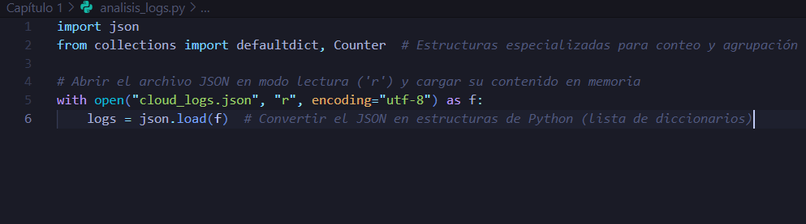

Paso 8. Como el JSON está convertido a una estructura de datos en Python (lista de diccionarios), se debe verificar cuántos registros tiene el dataset (`len`) y explorar la estructura del primer registro:

```python
# Mostrar cantidad total de registros
print(f"Total de registros: {len(logs)}")  

# Mostrar las claves del primer registro
print(f"\nClaves disponibles en un registro:")
print(list(logs[0].keys()))  

# Inspeccionar tipo de dato y ejemplo de cada campo
print(f"\nTipos de datos por campo:")
for clave, valor in logs[0].items():
    print(f" {clave}: {type(valor).__name__} → ejemplo: {valor}")  
```

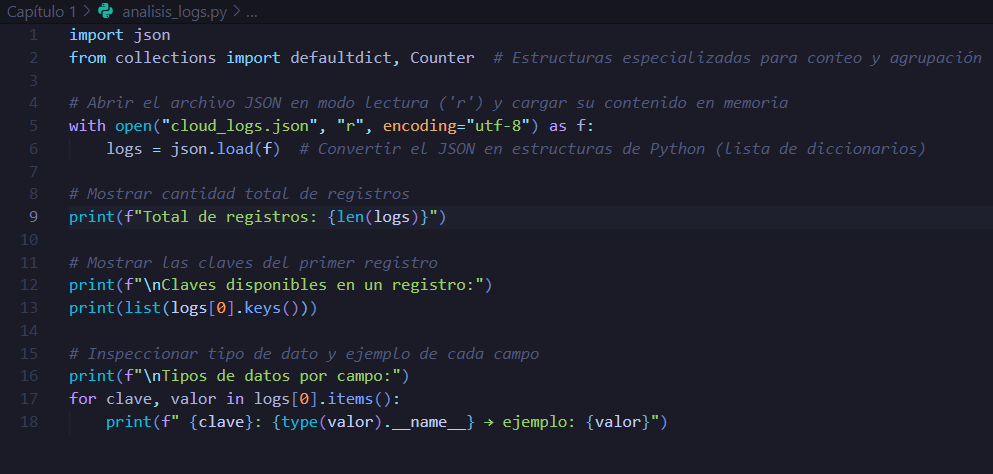

Paso 9. La información acerca de cuántos registros hay por tipo de evento se puede contar usando `Counter`, además de poder obtener un conteo por endpoint:

```python
# Contar cuántas veces aparece cada tipo de evento usando Counter
conteo_eventos = Counter(registro["event_type"] for registro in logs)

print(f"\nRegistros por tipo de evento:")
for evento, cantidad in conteo_eventos.items():
    print(f" {evento}: {cantidad}")

# Contar cuántas veces aparece cada endpoint usando Counter
conteo_endpoints = Counter(registro["endpoint"] for registro in logs)

print(f"\nRegistros por endpoint:")
for endpoint, cantidad in conteo_endpoints.items():
    print(f" {endpoint}: {cantidad}")
```

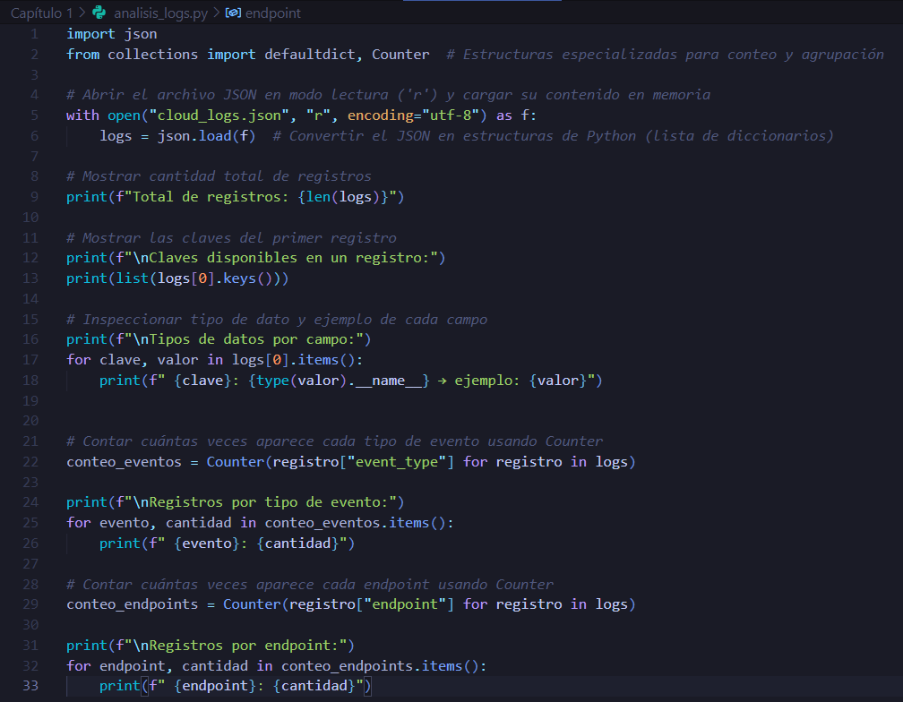

Paso 10. Verificar los resultados:

```shell
python analisis_logs.py
```

> Deberás ver el total de registros (30), las claves del dataset, los tipos de datos y los conteos por evento y endpoint.

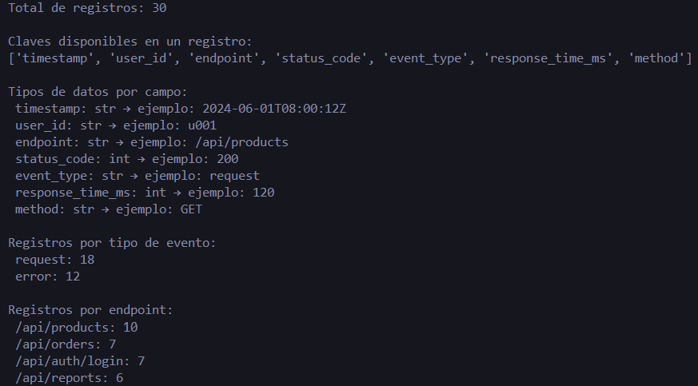

---

####  Analiza y Elige — Exploración de datos

Los tres fragmentos de código a continuación pueden **contar cuántos registros hay por tipo de evento**. Todos funcionan sin errores. Observe las diferencias en legibilidad, eficiencia y uso de herramientas de la biblioteca estándar, y determine cuál es **la mejor opción para un entorno profesional**.

**Opción A**

```python
conteo = {}
for registro in logs:
    tipo = registro["event_type"]
    if tipo in conteo:
        conteo[tipo] = conteo[tipo] + 1
    else:
        conteo[tipo] = 1
print(conteo)
```

**Opción B**

```python
conteo = Counter(registro["event_type"] for registro in logs)
print(dict(conteo))
```

**Opción C**

```python
tipos = []
for registro in logs:
    tipos.append(registro["event_type"])
tipos_unicos = list(set(tipos))
conteo = {}
for t in tipos_unicos:
    conteo[t] = tipos.count(t)
print(conteo)
```

<details>
<summary><strong> Ver respuesta recomendada</strong></summary>
<br>

**La Opción A es la más adecuada.**

| Criterio             | A                                              | B                                        | C                                                                |
| -------------------- | ---------------------------------------------- | ---------------------------------------- | ---------------------------------------------------------------- |
| **Legibilidad**      | Clara y explícita en cada paso del proceso     | Concisa pero menos evidente para novatos | Difícil de seguir                                                |
| **Eficiencia**       | O(n)                                           | O(n)                                     | O(n²) — `.count()` recorre la lista completa por cada tipo único |
| **Uso del estándar** | Implementación directa con estructuras básicas | Requiere conocer `collections.Counter`   | Mezcla `set`, `list` y `.count()` innecesariamente               |

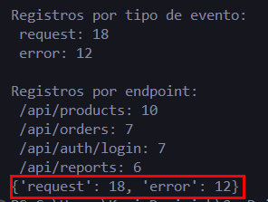

</details>


---

### Tarea 2. **Filtrado y transformación de datos**

Paso 11. Filtrar los registros de error y contar cuántos errores ocurrieron por cada endpoint:

```python
# Filtrar únicamente los registros cuyo tipo de evento sea "error"
registros_error = [registro for registro in logs if registro["event_type"] == "error"]

print(f"\nTotal de registros de error: {len(registros_error)}")

# Crear un diccionario que inicializa automáticamente cada endpoint en 0
errores_por_endpoint = defaultdict(int)

# Incrementar contador de errores por endpoint
for registro in registros_error:
    errores_por_endpoint[registro["endpoint"]] += 1

print(f"\nErrores por endpoint:")
for endpoint, cantidad in errores_por_endpoint.items():
    print(f" {endpoint}: {cantidad} error(es)")
```

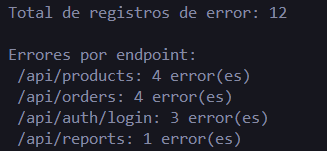

Paso 12. Obtener los IDs de usuarios únicos que accedieron a cada endpoint usando `defaultdict(set)`. Se utiliza esta estructura para **crear automáticamente un conjunto (`set`) de usuarios por cada endpoint**, registrando los accesos sin repetir IDs. De esta manera, es posible analizar qué usuarios distintos han interactuado con cada ruta de la aplicación:

```python
# Crear un diccionario donde cada endpoint almacena un conjunto de usuarios únicos
usuarios_por_endpoint = defaultdict(set)

for registro in logs:
    usuarios_por_endpoint[registro["endpoint"]].add(registro["user_id"])  
    # add() evita duplicados automáticamente gracias al uso de set

print(f"\nUsuarios únicos por endpoint:")
for endpoint, usuarios in usuarios_por_endpoint.items():
    print(f" {endpoint}: {len(usuarios)} usuario(s) → {usuarios}")
```

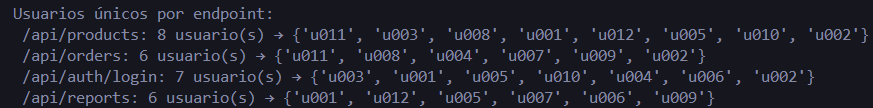

---

####  Analiza y Elige — Filtrado de registros

Los tres fragmentos de código a continuación cumplen la misma tarea: **extraer solo los registros de error y generar una lista con campos resumidos**. Todos funcionan sin errores. Analice cuál aplica la mejor práctica en cuanto a claridad, concisión y estilo Pythónico.

**Opción A**

```python
resumen = []
for reg in logs:
    if reg["event_type"] == "error":
        d = {}
        d["timestamp"] = reg["timestamp"]
        d["user_id"] = reg["user_id"]
        d["endpoint"] = reg["endpoint"]
        d["status_code"] = reg["status_code"]
        resumen.append(d)
```

**Opción B**

```python
campos = ["timestamp", "user_id", "endpoint", "status_code"]
resumen = [
    {campo: reg[campo] for campo in campos}
    for reg in logs
    if reg["event_type"] == "error"
]
```

**Opción C**

```python
resumen = []
i = 0
while i < len(logs):
    if logs[i]["event_type"] == "error":
        resumen.append({
            "timestamp": logs[i]["timestamp"],
            "user_id": logs[i]["user_id"],
            "endpoint": logs[i]["endpoint"],
            "status_code": logs[i]["status_code"]
        })
    i += 1
```

<details>
<summary><strong> Ver respuesta recomendada</strong></summary>
<br>

**La Opción B es la más adecuada.**

| Criterio             | A                                                                 | B                                              | C                                                    |
| -------------------- | ----------------------------------------------------------------- | ---------------------------------------------- | ---------------------------------------------------- |
| **Legibilidad**      | Aceptable, pero repetitiva                                        |  Clara: los campos se definen una sola vez    | Más difícil de leer por el uso de `while` con índice |
| **Mantenibilidad**   |  Si se agrega un campo, hay que añadir otra línea `d[...] = ...` |  Solo se agrega el nombre a la lista `campos` |  Misma situación que A, con mayor complejidad       |
| **Estilo Pythónico** | Imperativo básico                                                 |  Usa dict comprehension + list comprehension  |  El `while` con índice no es idiomático en Python   |


</details>

---

### Tarea 3. **Agregación y resumen final**

Paso 13. Obtener los usuarios y endpoints únicos, y calcular el tiempo de respuesta promedio por endpoint. Para ello, se utilizan **comprensiones de conjuntos (`set`)** para identificar los valores únicos de `user_id` y `endpoint` dentro de los registros. Posteriormente, se agrupan los tiempos de respuesta por endpoint usando `defaultdict(list)` y se calcula el promedio de estos tiempos, lo que permite **analizar el rendimiento de cada endpoint y comparar qué rutas del sistema responden más rápido o más lento**:

```python
# Obtener usuarios únicos mediante comprensión de conjunto
usuarios_unicos = {registro["user_id"] for registro in logs}
print(f"\nTotal de usuarios únicos: {len(usuarios_unicos)}")

# Obtener endpoints únicos
endpoints_unicos = {registro["endpoint"] for registro in logs}
print(f"Endpoints únicos: {endpoints_unicos}")

# Agrupar los tiempos de respuesta por endpoint
tiempos_por_endpoint = defaultdict(list)

for registro in logs:
    tiempos_por_endpoint[registro["endpoint"]].append(registro["response_time_ms"])
    # Se almacena cada tiempo en la lista correspondiente a su endpoint

# Calcular el promedio de tiempo por endpoint
promedio_tiempo = {
    endpoint: sum(tiempos) / len(tiempos)
    for endpoint, tiempos in tiempos_por_endpoint.items()
}

print(f"\nTiempo de respuesta promedio por endpoint (ms):")
for endpoint, promedio in promedio_tiempo.items():
    print(f" {endpoint}: {promedio:.2f} ms")
```

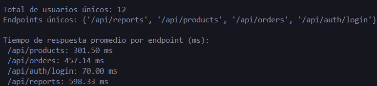

---

### Paso 14. Construir e imprimir el resumen general del análisis

En este paso se reúnen los resultados obtenidos durante el análisis para generar un **resumen consolidado** del comportamiento de los logs.

```python
# Consolidar todos los resultados en una única estructura tipo diccionario
resumen_general = {
    "total_registros": len(logs),
    "total_errores": len(registros_error),
    "total_requests_exitosos": len(logs) - len(registros_error),
    "usuarios_unicos": len(usuarios_unicos),
    "endpoints_unicos": list(endpoints_unicos),
    "errores_por_endpoint": dict(errores_por_endpoint),
    "usuarios_por_endpoint": {ep: list(us) for ep, us in usuarios_por_endpoint.items()},
    "promedio_tiempo_respuesta_ms": promedio_tiempo
}

print(f"\n{'='*60}")
print("RESUMEN GENERAL DEL ANÁLISIS DE LOGS")
print('='*60)

# Mostrar el resumen en formato JSON legible
print(json.dumps(resumen_general, indent=2, ensure_ascii=False))
```

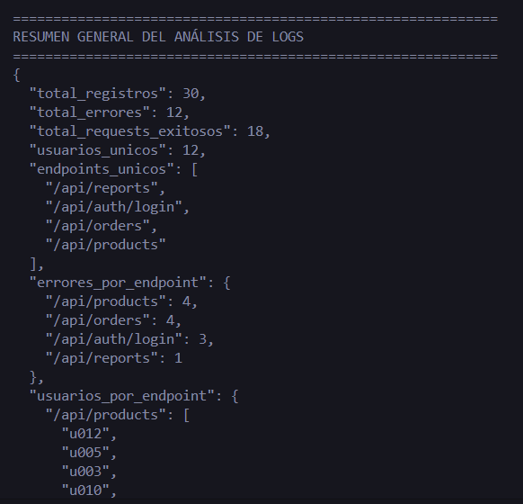

---

### Paso 15. Ejecutar el script completo para ver todos los resultados

```shell
python analisis_logs.py
```

---

##  Analiza

En el **Paso 13** se utilizó un enfoque común en análisis de datos: **primero agrupar la información y luego aplicar cálculos agregados sobre cada grupo**.

En este caso, se agrupan los **tiempos de respuesta por endpoint** y posteriormente se calcula el **promedio de cada grupo**. Este patrón es frecuente en tareas de análisis porque permite procesar los datos de forma más clara y eficiente.

### Actividad

Agregue comentarios al siguiente fragmento de código explicando:

* por qué se usa `defaultdict(list)`
* por qué se agrupan los tiempos por endpoint
* por qué el cálculo del promedio se realiza después de agrupar los datos
* qué ventaja tiene separar el proceso en **agrupación → cálculo**

```python
tiempos_por_endpoint = defaultdict(list)
for registro in logs:
    tiempos_por_endpoint[registro["endpoint"]].append(registro["response_time_ms"])
promedio_tiempo = {
    endpoint: sum(tiempos) / len(tiempos)
    for endpoint, tiempos in tiempos_por_endpoint.items()
}
```

Tu objetivo es que, al leer el código comentado, **otra persona pueda comprender fácilmente qué problema resuelve este fragmento y por qué se eligió esta forma de implementarlo**.

---

<details>
<summary><strong> Ver Ejemplo de respuesta</strong></summary>

```python
# Crear un diccionario donde cada endpoint tendrá asociada una lista
# de tiempos de respuesta. defaultdict(list) permite que la lista
# se cree automáticamente cuando aparece un endpoint nuevo.
tiempos_por_endpoint = defaultdict(list)

# Recorrer todos los registros del log para agrupar los tiempos
# de respuesta según el endpoint al que pertenece cada solicitud.
# Esto permite reunir todos los tiempos relacionados con una misma ruta.
for registro in logs:
    tiempos_por_endpoint[registro["endpoint"]].append(registro["response_time_ms"])

# Una vez agrupados los tiempos por endpoint, se calcula el promedio
# de cada grupo. Se usa una dict comprehension para generar un
# diccionario limpio donde cada endpoint se asocia a su tiempo
# promedio de respuesta.
promedio_tiempo = {
    endpoint: sum(tiempos) / len(tiempos)
    for endpoint, tiempos in tiempos_por_endpoint.items()
}
```

</details>

---

### Resultado esperado

Al ejecutar el script completo, la terminal deberá mostrar una salida similar a la siguiente:

```
Total de registros: 30
Claves disponibles en un registro:
['timestamp', 'user_id', 'endpoint', 'status_code', 'event_type', 'response_time_ms', 'method']
Tipos de datos por campo:
  timestamp: str → ejemplo: 2024-06-01T08:00:12Z
  user_id: str → ejemplo: u001
  endpoint: str → ejemplo: /api/products
  status_code: int → ejemplo: 200
  event_type: str → ejemplo: request
  response_time_ms: int → ejemplo: 120
  method: str → ejemplo: GET
Registros por tipo de evento:
  request: 18
  error: 12
Registros por endpoint:
  /api/products: 11
  /api/orders: 8
  /api/auth/login: 7
  /api/reports: 4
Total de registros de error: 12
...
============================================================
RESUMEN GENERAL DEL ANÁLISIS DE LOGS
============================================================
{
  "total_registros": 30,
  "total_errores": 12,
  "total_requests_exitosos": 18,
  "usuarios_unicos": 12,
  "endpoints_unicos": ["/api/products", "/api/orders", "/api/auth/login", "/api/reports"],
  "errores_por_endpoint": { ... },
  "usuarios_por_endpoint": { ... },
  "promedio_tiempo_respuesta_ms": { ... }
}
```
