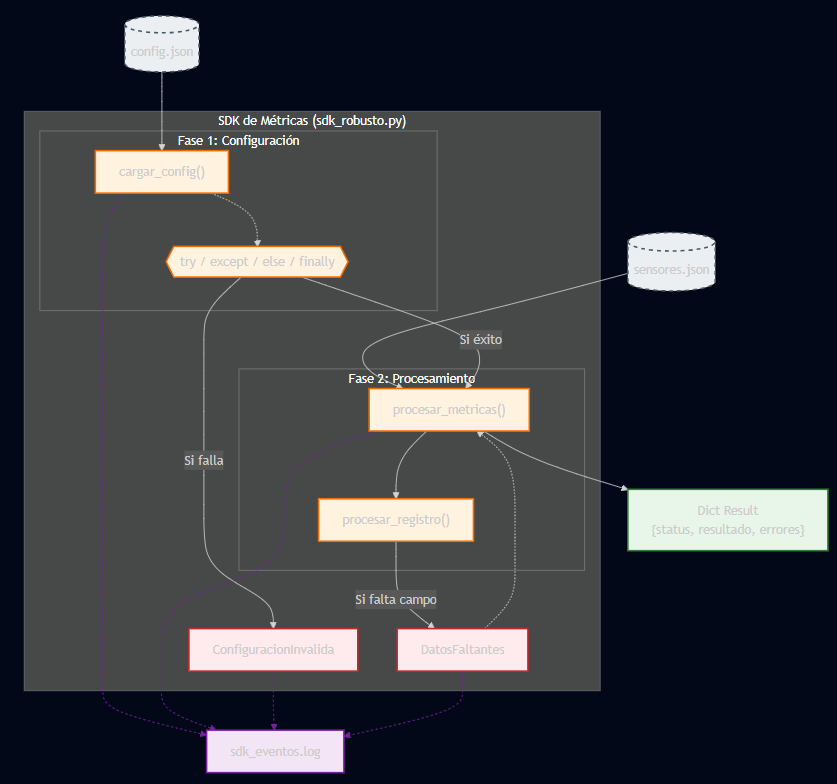
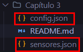
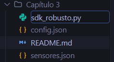
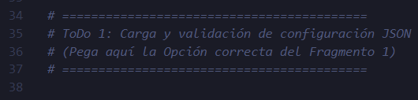

# SDK de Configuración y Métricas Robusto

## Objetivo de la práctica:

Al finalizar la práctica, serás capaz de:

* Construir un mini-SDK modular en Python que cargue configuraciones desde un archivo JSON y procese métricas de sensores.
* Implementar manejo profesional de errores mediante excepciones personalizadas, logging y estructuras `try-except-else-finally`.
* Definir contratos claros de retorno en cada función y aplicar prácticas de calidad propias del desarrollo de SDKs de servicios en la nube.

## Objetivo Visual



## Duración aproximada:
- 20–25 minutos.

## Instrucciones

### **CONFIGURACIÓN DEL ENTORNO DE TRABAJO**

Paso 1. Abrir **Visual Studio Code**.

Paso 2. En el menú superior, seleccionar `Archivo` → `Abrir carpeta` y navegar hasta la carpeta del laboratorio `Capítulo 3`.


Paso 3. Verificar que los siguientes archivos estén presentes en la carpeta:
- `config.json` — configuración del SDK en formato JSON.
- `sensores.json` — dataset de métricas con 10 registros (incluye valores nulos).



Paso 4. Crea un nuevo archivo Python llamado `sdk_robusto.py` en VS Code y **copia y pega el siguiente código base**. 



Este código ya tiene implementada la lógica de procesamiento, la configuración de logging y las excepciones personalizadas. 

Se debe completar el bloque faltante (`ToDo 1`) analizando y eligiendo la mejor opción para la carga de configuración JSON.
Las alternativas se muestran en la *Tarea 1*



```python
import json
import logging
from typing import Any, Dict, List, Optional

# ==========================================
# Configuración del sistema de logging
# ==========================================
logging.basicConfig(
    level=logging.INFO,
    format="%(asctime)s | %(levelname)-8s | %(message)s",
    datefmt="%Y-%m-%d %H:%M:%S",
    handlers=[
        logging.StreamHandler(),
        logging.FileHandler("sdk_eventos.log", encoding="utf-8")
    ]
)
logger = logging.getLogger("sdk_metricas")

# ==========================================
# Excepciones personalizadas
# ==========================================
class ConfiguracionInvalida(Exception):
    def __init__(self, mensaje: str, clave_faltante: Optional[str] = None):
        super().__init__(mensaje)
        self.clave_faltante = clave_faltante

class DatosFaltantes(Exception):
    def __init__(self, mensaje: str, campo: Optional[str] = None):
        super().__init__(mensaje)
        self.campo = campo

CLAVES_OBLIGATORIAS = ["api", "procesamiento", "logging"]

# ==========================================
# ToDo 1: Carga y validación de configuración JSON
# (Pega aquí la Opción correcta del Fragmento 1)
# ==========================================


CAMPOS_NUMERICOS = ["cpu_pct", "mem_pct", "latency_ms"]

def procesar_registro(registro: Dict[str, Any]) -> Dict[str, Any]:
    for campo in CAMPOS_NUMERICOS:
        if registro.get(campo) is None:
            logger.warning(
                f"Campo nulo detectado — sensor_id: {registro.get('sensor_id', 'DESCONOCIDO')}, "
                f"campo: '{campo}'"
            )
            # Lanzamos la excepción personalizada de datos faltantes
            raise DatosFaltantes(
                f"El campo '{campo}' es nulo en el sensor '{registro.get('sensor_id')}'.",
                campo=campo
            )

    return {
        "sensor_id"  : registro["sensor_id"],
        "service"    : registro["service"],
        "cpu_pct"    : registro["cpu_pct"],
        "mem_pct"    : registro["mem_pct"],
        "latency_ms" : registro["latency_ms"],
        "timestamp"  : registro["timestamp"]
    }

def procesar_metricas(sensores: List[Dict[str, Any]], config: Dict[str, Any]) -> Dict[str, Any]:
    validos = []
    errores = []

    for registro in sensores:
        try:
            procesado = procesar_registro(registro)
            validos.append(procesado)
        except DatosFaltantes as e:
            errores.append({
                "sensor_id" : registro.get("sensor_id", "DESCONOCIDO"),
                "campo_nulo": e.campo,
                "detalle"   : str(e)
            })

    if validos:
        cpus      = [r["cpu_pct"]    for r in validos]
        latencias = [r["latency_ms"] for r in validos]
        resumen   = {
            "total_procesados" : len(sensores),
            "validos"          : len(validos),
            "invalidos"        : len(errores),
            "cpu_promedio"     : round(sum(cpus) / len(cpus), 2),
            "latencia_promedio": round(sum(latencias) / len(latencias), 2),
        }
        status = "ok" if not errores else "parcial"
    else:
        resumen = {}
        status  = "error"

    logger.info(f"Procesamiento completado — válidos: {len(validos)}, inválidos: {len(errores)}")
    return {"status": status, "resultado": resumen, "errores": errores}

if __name__ == "__main__":
    print(f"\n{'='*60}")
    print("TAREA 2 — CARGA Y VALIDACIÓN DE CONFIGURACIÓN")
    print('='*60)

    try:
        config = cargar_config("config.json")
        print(f"\n  Endpoint: {config['api']['endpoint']}")
        print(f"  Región  : {config['procesamiento']['region']}")
    except ConfiguracionInvalida as e:
        print(f"\n  [ERROR ConfiguracionInvalida]: {e}")

    print(f"\n  [Prueba de error — archivo inexistente]")
    try:
        cargar_config("config_inexistente.json")
    except ConfiguracionInvalida as e:
        print(f"  Excepción capturada correctamente: {e}")

    print(f"\n{'='*60}")
    print("TAREA 3 — PROCESAMIENTO DE MÉTRICAS")
    print('='*60)

    try:
        with open("sensores.json", "r", encoding="utf-8") as f:
            sensores = json.load(f)
        logger.info(f"Sensores cargados: {len(sensores)} registros.")
    except (FileNotFoundError, json.JSONDecodeError) as e:
        print(f"  [ERROR al cargar sensores]: {e}")
        sensores = []

    if sensores and 'config' in locals():
        resultado = procesar_metricas(sensores, config)
        print(f"\n  Status del procesamiento : {resultado['status']}")
        print(f"\n  Resumen estadístico:")
        for clave, valor in resultado["resultado"].items():
            print(f"    {clave:<25}: {valor}")
        if resultado["errores"]:
            print(f"\n  Registros con errores ({len(resultado['errores'])}):")
            for err in resultado["errores"]:
                print(f"    → sensor_id: {err['sensor_id']} | campo nulo: '{err['campo_nulo']}' | {err['detalle']}")
```

---
### Tarea 1. Análisis de código — Fragmento 1: Carga de archivo con manejo de errores

Paso 5. Definir la función `cargar_config()`. Usa `try-except-else-finally` completo:
  - `try`: intenta abrir y parsear el archivo JSON.
  - `except FileNotFoundError`: captura si el archivo no existe.
  - `except json.JSONDecodeError`: captura si el JSON tiene sintaxis incorrecta.
  - `else`: se ejecuta solo si no hubo excepción; aquí se registra el éxito con `logger.info`.
  - `finally`: se ejecuta **siempre**, haya o no error; útil para liberar recursos o registrar el cierre.

Las tres opciones cargan un archivo JSON y **funcionan sin error** cuando el archivo existe y es válido. Analiza cuál maneja los errores de forma más robusta y profesional.

**Opción A:**
```python
def cargar_config(ruta: str) -> Dict[str, Any]:
    archivo = open(ruta, "r", encoding="utf-8")
    config = json.load(archivo)
    archivo.close()
    return config
```

**Opción B:**
```python
def cargar_config(ruta: str) -> Dict[str, Any]:
    try:
        with open(ruta, "r", encoding="utf-8") as f:
            return json.load(f)
    except Exception:
        return {}
```

**Opción C:**
```python
def cargar_config(ruta: str) -> Dict[str, Any]:
    archivo = None
    try:
        archivo = open(ruta, "r", encoding="utf-8")
        config = json.load(archivo)
    except FileNotFoundError:
        logger.error(f"Archivo no encontrado: '{ruta}'")
        raise ConfiguracionInvalida(
            f"No se encontró el archivo de configuración: '{ruta}'"
        )
    except json.JSONDecodeError as e:
        logger.error(f"JSON malformado en '{ruta}': {e}")
        raise ConfiguracionInvalida(
            f"El archivo '{ruta}' no es un JSON válido. Detalle: {e}"
        )
    else:
        logger.info(f"Configuración JSON cargada correctamente desde '{ruta}'.")
        return config
    finally:
        if archivo:
            archivo.close()
            logger.info(f"Archivo '{ruta}' cerrado.")
```

<details markdown="1">
<summary><strong> Ver respuesta recomendada</strong></summary>

<br>

**La Opción C es la más adecuada.**

| Criterio | A | B | C |
|---|---|---|---|
| **Manejo de Errores** |  Inexistente. Causa un crash de ser necesario | Silencia errores globalmente (`except Exception`) |  Diferenciado por origen (`FileNotFoundError`, `JSONDecodeError`) |
| **Cierre de Archivo** |  No cierra el cursor si explota al parsear |  Automático via `with` |  Garantizado en su bloque `finally` |
| **Trazabilidad** | Nula ante fallos |  Devuelve `{}` ocultando que no cargó nada |  Registra en logs y usa Excepciones de Dominio |


</details>

---
### Tarea 2. **Ejecución y Comprobación**

Paso 6. Guarda el archivo `sdk_robusto.py` y ejecútalo en la terminal integrada de VS Code:

```shell
python sdk_robusto.py
```

### Resultado esperado

Al ejecutar el script completo, la terminal deberá mostrar una salida similar a la siguiente:

```
============================================================
TAREA 2 — CARGA Y VALIDACIÓN DE CONFIGURACIÓN
============================================================
2024-06-01 09:00:00 | INFO     | Configuración cargada y validada desde 'config.json'.
2024-06-01 09:00:00 | INFO     | Archivo 'config.json' cerrado.

  Endpoint: https://api.mi-nube.com/v2/metricas
  Región  : us-east-1

  [Prueba de error — archivo inexistente]
2024-06-01 09:00:00 | ERROR    | Archivo no encontrado: 'config_inexistente.json'
  Excepción capturada correctamente: No se encontró el archivo de configuración: 'config_inexistente.json'

============================================================
TAREA 3 — PROCESAMIENTO DE MÉTRICAS
============================================================
2024-06-01 09:00:00 | INFO     | Sensores cargados: 10 registros.
2024-06-01 09:00:00 | WARNING  | Campo nulo detectado — sensor_id: s-004, campo: 'cpu_pct'
2024-06-01 09:00:00 | WARNING  | Campo nulo detectado — sensor_id: s-007, campo: 'mem_pct'
2024-06-01 09:00:00 | WARNING  | Campo nulo detectado — sensor_id: s-010, campo: 'latency_ms'
2024-06-01 09:00:00 | INFO     | Procesamiento completado — válidos: 7, inválidos: 3

  Status del procesamiento : parcial

  Resumen estadístico:
    total_procesados         : 10
    validos                  : 7
    invalidos                : 3
    cpu_promedio             : 60.34
    latencia_promedio        : 379.29

  Registros con errores (3):
    → sensor_id: s-004 | campo nulo: 'cpu_pct'      | El campo 'cpu_pct' es nulo...
    → sensor_id: s-007 | campo nulo: 'mem_pct'       | El campo 'mem_pct' es nulo...
    → sensor_id: s-010 | campo nulo: 'latency_ms'    | El campo 'latency_ms' es nulo...
```
