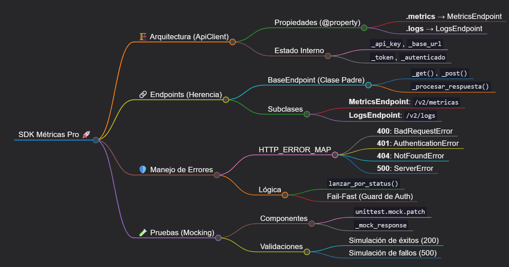
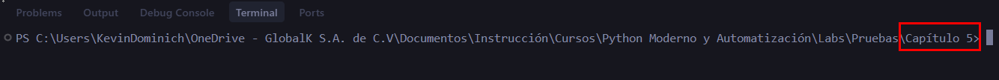
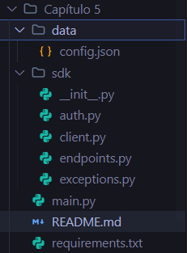
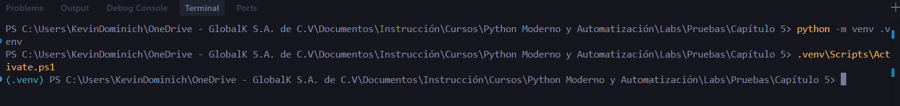
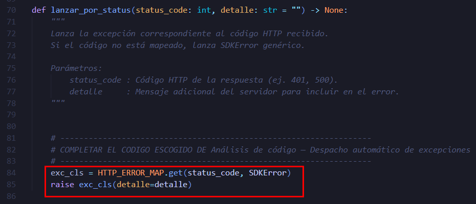
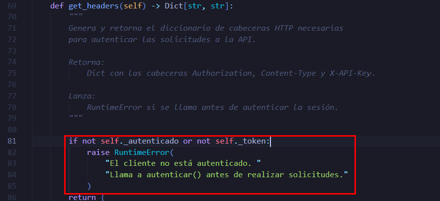
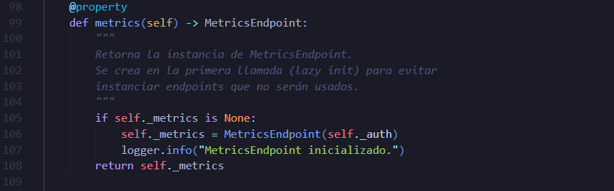
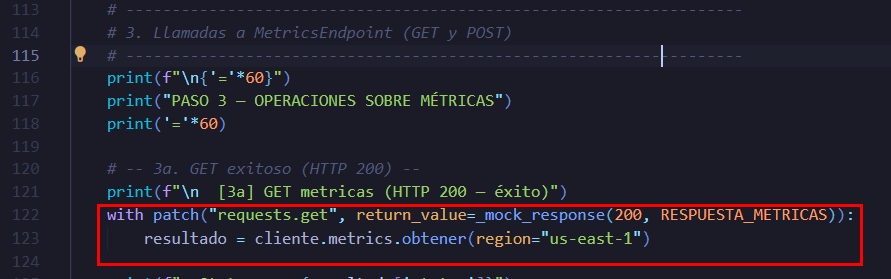

# Mini-SDK Profesional de Métricas en la Nube

## Objetivo de la práctica:

Al finalizar la práctica, serás capaz de:

* Diseñar un mini-SDK en Python orientado a objetos utilizando jerarquías de clases, encapsulamiento, propiedades y herencia.
* Implementar manejo profesional de errores HTTP mediante excepciones personalizadas y construir un cliente REST usando la librería `requests`.
* Analizar y probar llamadas HTTP mediante `unittest.mock.patch`, permitiendo validar el SDK sin necesidad de un servidor en ejecución.

## Objetivo Visual



## Duración aproximada:
- 25–30 minutos.

## Instrucciones

### **CONFIGURACIÓN DEL ENTORNO DE TRABAJO**

Paso 1. Abrir **Visual Studio Code**.

Paso 2. En el menú superior, seleccionar `Archivo` → `Abrir carpeta` y navegar hasta la carpeta del laboratorio `Capítulo 5`.


Es importante abrir **la carpeta raíz** `Capítulo 5/` para que Python encuentre el paquete `sdk/` al ejecutar `main.py`.



Paso 3. Verificar que la estructura de archivos sea la correcta. En el explorador de VS Code deben verse una carpeta `sdk/` con 5 archivos (`__init__.py`, `exceptions.py`, `auth.py`, `endpoints.py`, `client.py`), una carpeta `data/` con `config.json`, y los archivos `main.py` y `requirements.txt` en la raíz.



Paso 4. Abrir la terminal integrada y crear el entorno virtual:

```shell
python -m venv .venv
```

Paso 5. Activar el entorno virtual:

```shell
.venv\Scripts\Activate.ps1
```



Paso 6. Instalar las dependencias desde `requirements.txt`:

```shell
pip install -r requirements.txt
```

---

### Tarea 1. **Analizar el diseño de la jerarquía de excepciones** (`sdk/exceptions.py`)

Paso 7. Abrir el archivo `sdk/exceptions.py` y observar la clase base `SDKError`. Esta clase hereda de `Exception` y agrega información adicional como `status_code` y `detalle`, lo que permite representar errores HTTP de forma estructurada dentro del SDK. Verificar como las subclases (`AuthenticationError`, `BadRequestError`, etc.) representan tipos específicos de error. Esto permite que el código que utiliza el SDK pueda reaccionar de forma distinta según el tipo de fallo.

Paso 8. Localizar la función `lanzar_por_status()` y su diccionario `HTTP_ERROR_MAP`:

```python
HTTP_ERROR_MAP = {
    400: BadRequestError,
    401: AuthenticationError,
    404: NotFoundError,
    429: RateLimitError,
    500: ServerError,
}
```

> Este diccionario funciona como un **despachador**: traduce un código HTTP en la clase de excepción correspondiente. En lugar de evaluar muchos `if/elif`, el SDK puede buscar directamente la excepción apropiada en el diccionario mejorando la legibilidad y extensibilidad del código. *Agregar soporte para un nuevo error solo requiere añadir una entrada al diccionario.*

#### Análisis de código — Despacho de excepciones

La función `lanzar_por_status()` debe utilizar el diccionario `HTTP_ERROR_MAP` para determinar qué excepción lanzar según el código HTTP recibido.

Dado el archivo `sdk/exceptions.py`, desde la linea 84, completa la implementación seleccionando la opción que **usa correctamente el diccionario despachador y mantiene el comportamiento esperado del SDK cuando aparece un código HTTP desconocido**.

```python
def lanzar_por_status(status_code: int, detalle: str = "") -> None:
    exc_cls = ______________________________
    raise _________________________________
```

**Opciones**

**A**

```python
exc_cls = HTTP_ERROR_MAP.get(status_code, SDKError)
raise exc_cls(detalle=detalle)
```

**B**

```python
exc_cls = HTTP_ERROR_MAP.get(status_code)
raise exc_cls(detalle=detalle)
```

**C**

```python
exc_cls = HTTP_ERROR_MAP.get(status_code, SDKError)
raise exc_cls()
```

---

<details markdown="1">
<summary><strong> Ver respuesta correcta</strong></summary>

<br>

**La opción correcta es la A.**

```python
exc_cls = HTTP_ERROR_MAP.get(status_code, SDKError)
raise exc_cls(detalle=detalle)
```

* `.get(status_code, SDKError)` obtiene la clase de excepción asociada al código HTTP.
* Si el código no existe en el diccionario, se usa **`SDKError` como valor por defecto**, evitando un error inesperado.
* Luego se instancia la excepción pasando el parámetro `detalle`, conservando la información del error.

**Opciones Incorrectas**

| Opción | Problema                                                                                                                                |
| ------ | --------------------------------------------------------------------------------------------------------------------------------------- |
| **B**  | Si el `status_code` no existe en el diccionario, `.get()` devuelve `None` y se produce un error al intentar llamar `None(detalle=...)`. |
| **C**  | No pasa el parámetro `detalle`, por lo que se pierde información relevante del error.                                                   |



</details>


---

### Tarea 2. **Analizar el encapsulamiento y las propiedades** (`sdk/auth.py`)

Paso 9. Abrir el archivo `sdk/auth.py` e identificar los atributos privados definidos en el constructor (`_api_key`, `_base_url`, `_token`, `_autenticado`). El prefijo `_` indica que estos atributos forman parte del estado interno del objeto y no deberían modificarse directamente desde el exterior:

```python
def __init__(self, api_key: str, base_url: str) -> None:
    self._api_key     = api_key
    self._base_url    = base_url
    self._token       = None       # None hasta autenticar
    self._autenticado = False

@property
def autenticado(self) -> bool:
    return self._autenticado

@property
def base_url(self) -> str:
    return self._base_url
```

Paso 10. Leer el método `get_headers()`. Notar que se busca lanzar `RuntimeError` si el cliente no está autenticado. Esta es la primera línea de defensa que protege los endpoints de ejecutarse sin credenciales válidas.

#### Análisis de código — Protección del estado interno

El método `get_headers()` debe devolver las cabeceras necesarias para realizar solicitudes HTTP autenticadas.
Sin embargo, el SDK debe **evitar que se envíen solicitudes si el cliente no está autenticado**.

Completa la implementación seleccionando la opción que **verifica correctamente el estado de autenticación y comunica el error de forma explícita**.

```python
def get_headers(self) -> Dict[str, str]:
    ______________________________
    return {
        "Authorization": f"Bearer {self._token}",
        "Content-Type": "application/json",
        "X-API-Key": self._api_key,
    }
```

**Opciones**

**A**

```python
if not self._autenticado or not self._token:
    raise RuntimeError(
        "El cliente no está autenticado. "
        "Llama a autenticar() antes de realizar solicitudes."
    )
```

**B**

```python
if not self._autenticado or not self._token:
    return {}
```

**C**

```python
if not self._autenticado or not self._token:
    self._autenticado = True
```

---

<details markdown="1">
<summary><strong> Ver respuesta correcta</strong></summary>

<br>

**La opción correcta es la A.**

```python
if not self._autenticado or not self._token:
    raise RuntimeError(
        "El cliente no está autenticado. "
        "Llama a autenticar() antes de realizar solicitudes."
    )
```

Esta implementación sigue el principio **Fail-Fast**:

* Si el cliente no está autenticado, el método **detiene inmediatamente la ejecución**.
* El error es **explícito y local**, lo que facilita al desarrollador identificar el problema.
* Evita enviar solicitudes HTTP inválidas al servidor.

---

**Opciones Incorrectas**

| Opción | Problema                                                                                                                                   |
| ------ | ------------------------------------------------------------------------------------------------------------------------------------------ |
| **B**  | Falla silenciosamente devolviendo `{}`. La solicitud se enviará sin cabeceras de autenticación, generando errores confusos en el servidor. |
| **C**  | Modifica el estado interno del objeto de forma incorrecta, marcando al cliente como autenticado sin haber obtenido un token válido.        |



</details>

---

### Tarea 3. **Analizar la herencia y el patrón lazy initialization** (`sdk/endpoints.py` y `sdk/client.py`)

Paso 11. Abrir el archivo `sdk/endpoints.py`. Leer la clase `BaseEndpoint` en la *linea 21* e identificar:
  - El atributo `_path` que cada subclase define para construir su URL.
  - Los métodos protegidos `_get()` y `_post()`, disponibles para las subclases pero no pensados para uso externo.
  - El método `_procesar_respuesta()` que centraliza la lógica de interpretar códigos HTTP.

Paso 12. Leer las subclases `MetricsEndpoint` y `LogsEndpoint`. Notar que cada una llama a `super().__init__(auth, path="/v2/...")` para registrar su ruta y define métodos públicos que internamente usan `self._get()` o `self._post()` heredados de `BaseEndpoint`.


### Análisis de código — Inicialización de endpoints en `ApiClient`

El cliente del SDK expone los endpoints como propiedades (`metrics`, `logs`) en el archivo `sdk/client.py`.
El objetivo es **evitar crear objetos innecesarios al iniciar el cliente**, pero **mantener la misma instancia del endpoint durante toda la vida del objeto**.

Completa la implementación del método `metrics` seleccionando la opción que **inicializa el endpoint solo cuando se necesita y reutiliza la misma instancia en llamadas posteriores**, en la linea 106.

```python
@property
def metrics(self) -> MetricsEndpoint:
    ______________________________
```

**Opciones**

**A**

```python
if self._metrics is None:
    self._metrics = MetricsEndpoint(self._auth)
    logger.info("MetricsEndpoint inicializado.")
return self._metrics
```

**B**

```python
return MetricsEndpoint(self._auth)
```

**C**

```python
if self._metrics is None:
    return MetricsEndpoint(self._auth)
return self._metrics
```

---

<details markdown="1">
<summary><strong> Ver respuesta recomendada</strong></summary>

<br>

**La opción correcta es la A.**

```python
if self._metrics is None:
    self._metrics = MetricsEndpoint(self._auth)
    logger.info("MetricsEndpoint inicializado.")
return self._metrics
```

Esta implementación aplica el patrón **Lazy Initialization con caché**:

* El endpoint **no se crea hasta que se accede por primera vez**.
* Una vez creado, se **almacena en `_metrics`**.
* Las llamadas posteriores reutilizan **la misma instancia**, manteniendo estado y evitando trabajo innecesario.

Además, se registra en el logger cuándo el endpoint es inicializado.

---

**Opciones Incorrectas**

| Opción | Problema                                                                                                                             |
| ------ | ------------------------------------------------------------------------------------------------------------------------------------ |
| **B**  | Crea una nueva instancia de `MetricsEndpoint` en cada acceso a la propiedad, generando múltiples objetos innecesarios.               |
| **C**  | Crea el endpoint cuando `_metrics` es `None`, pero **no lo guarda en `_metrics`**, por lo que el objeto se recreará en cada llamada. |



</details>


---

## Análisis de código — Respuestas HTTP

Durante las pruebas del SDK no existe un servidor real.
Para analizar respuestas HTTP se utiliza **`unittest.mock`** para interceptar llamadas a `requests.get` en el archivo `main.py`, en la linea 123.

Completa el siguiente fragmento seleccionando la opción que **completa correctamente la llamada HTTP sin modificar permanentemente el comportamiento de `requests.get`**.

```python
resultado = None

______________________________
    resultado = cliente.metrics.obtener(region="us-east-1")
```

**Opciones**

**A**

```python
requests.get = lambda *args, **kwargs: _mock_response(200, RESPUESTA_METRICAS)
```

**B**

```python
with patch("requests.get", return_value=_mock_response(200, RESPUESTA_METRICAS)):
    resultado = cliente.metrics.obtener(region="us-east-1")
```

**C**

```python
@patch("requests.get",
       return_value=_mock_response(200, RESPUESTA_METRICAS))
def ejecutar(mock_get):
```

---

<details markdown="1">
<summary><strong> Ver respuesta recomendada</strong></summary>

<br>

**La opción correcta es la B.**

```python
with patch("requests.get", return_value=_mock_response(200, RESPUESTA_METRICAS)):
    resultado = cliente.metrics.obtener(region="us-east-1")
```

El uso de `patch` como **context manager** permite:

* Interceptar temporalmente las llamadas a `requests.get`.
* Limitar el comportamiento **solo al bloque `with`**.
* Restaurar automáticamente la implementación original cuando termina el bloque.

Esto mantiene las pruebas **aisladas y predecibles**.

---

**Opciones Incorrectas**

| Opción | Problema                                                                                                                               |
| ------ | -------------------------------------------------------------------------------------------------------------------------------------- |
| **A**  | Reemplaza `requests.get` globalmente mediante *monkey patching*, lo que puede afectar otras partes del programa o pruebas posteriores. |
| **C**  | El decorador `@patch` está diseñado para funciones completas, no para insertarse dentro de un bloque de ejecución como en este caso.   |



</details>

---

# Tarea 4. **Ejecutar el mini-SDK y verificar el flujo completo**

Paso 13. Con el entorno virtual activo (`(.venv)` en el prompt), asegurarse de guardar todas las modificaciones realizadas en todos los archivos de código y ejecutar el script principal:

```shell
python main.py
```

Paso 14. Observar en la salida los 5 pasos del flujo:

1. **Configuración**: carga de `config.json`.
2. **Autenticación**: creación de `ApiClient` y llamada a `autenticar()`.
3. **Métricas**: GET exitoso (200), POST exitoso (201), POST con error (500).
4. **Logs**: GET exitoso (200), GET con error de autenticación (401).
5. **Guard de autenticación**: cierre de sesión y `RuntimeError` al intentar operar sin sesión.

Paso 15. Verificar el archivo `sdk_eventos.log` generado en la raíz del proyecto:

```shell
type sdk_eventos.log
```


---

### Resultado esperado

Al ejecutar `python main.py`, la terminal debe mostrar:

```
2024-06-01 09:00:00 | INFO     | sdk_nube | Logger inicializado. Log guardado en: 'sdk_eventos.log'
2024-06-01 09:00:00 | INFO     | sdk_nube | ApiClient inicializado → base_url: 'https://api.mi-nube.com'

============================================================
PASO 1 — CONFIGURACIÓN CARGADA
============================================================
  Base URL : https://api.mi-nube.com
  Región   : us-east-1

============================================================
PASO 2 — CREACIÓN Y AUTENTICACIÓN DEL CLIENTE
============================================================
  Estado inicial : ApiClient(base_url='https://api.mi-nube.com', estado='no autenticado')
2024-06-01 09:00:00 | INFO     | sdk_nube | Iniciando autenticación del cliente...
2024-06-01 09:00:00 | INFO     | sdk_nube | Autenticación completada. Sesión activa.
  Estado final   : ApiClient(base_url='https://api.mi-nube.com', estado='autenticado')
  Autenticado    : True

============================================================
PASO 3 — OPERACIONES SOBRE MÉTRICAS
============================================================

  [3a] GET metricas (HTTP 200 — éxito)
2024-06-01 09:00:00 | INFO     | sdk_nube | GET https://api.mi-nube.com/v2/metricas | params={'region': 'us-east-1'}
2024-06-01 09:00:00 | INFO     | sdk_nube | Respuesta recibida: HTTP 200
2024-06-01 09:00:00 | INFO     | sdk_nube | Solicitud exitosa (HTTP 200).
  Status   : ok
  Total    : 3 sensores
    • s-001 (api-gateway) CPU=72.4%  LAT=210ms
    • s-002 (db-primary) CPU=91.8%  LAT=620ms
    • s-003 (auth-service) CPU=34.5%  LAT=95ms

  [3c] POST metricas (HTTP 201 — creado)
  Status   : ok
  Mensaje  : Lote recibido correctamente.
  Job ID   : job-7f3a9c12

  [3d] POST metricas (HTTP 500 — error de servidor)
2024-06-01 09:00:00 | ERROR    | sdk_nube | Error HTTP 500: Error interno del servidor...
  Status   : error
  Errores  : ['[HTTP 500] Error interno del servidor.']

============================================================
PASO 4 — OPERACIONES SOBRE LOGS
============================================================

  [4b] GET logs por nivel (HTTP 401 — no autorizado)
2024-06-01 09:00:00 | ERROR    | sdk_nube | Error HTTP 401: Token inválido o expirado.
  Status   : error
  Errores  : ['[HTTP 401] Autenticación fallida: token inválido o expirado.']

============================================================
PASO 5 — CIERRE DE SESIÓN Y GUARD DE AUTENTICACIÓN
============================================================

  [Prueba] Intentar solicitud sin sesión activa:
  RuntimeError capturado correctamente: El cliente no está autenticado...

============================================================
Ejecución del mini-SDK completada.
============================================================
```


